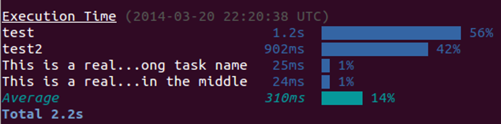

# time-grunt [](http://travis-ci.org/sindresorhus/time-grunt) [](http://gruntjs.com/)

> Displays the execution time of [grunt](http://gruntjs.com) tasks


## Install

Install with [npm](https://npmjs.org/package/time-grunt)

```
npm install --save time-grunt
```


## Example

```js
// Gruntfile.js
module.exports = function (grunt) {
	// require it at the top and pass in the grunt instance
	require('time-grunt')(grunt);

	grunt.initConfig();
}
```

## Clean layout

Tasks that take less than 1% of the total time are hidden to reduce clutter.

Run grunt with `grunt --verbose` to see all tasks.

## Show average

If you are testing performance it's nice to show the average performance of the tasks. 


```grunt --average``` or ```grunt -a```



_Catch: Fewer then 3 tasks will not show *average* at any given time._

## License

MIT © [Sindre Sorhus](http://sindresorhus.com)
