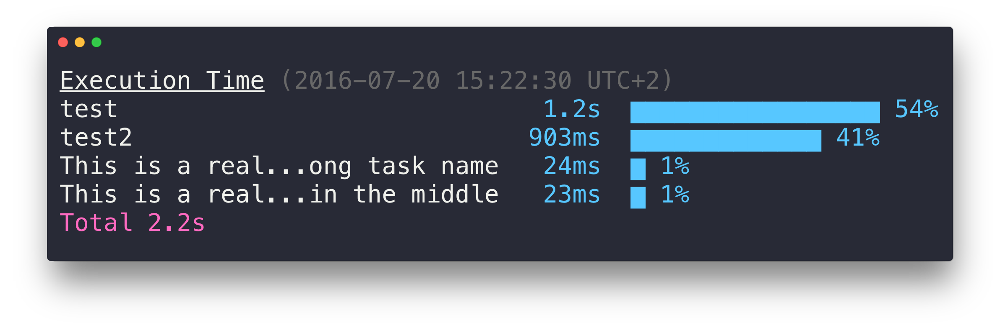

# time-grunt [](https://travis-ci.org/sindresorhus/time-grunt)

> Display the elapsed execution time of [grunt](http://gruntjs.com) tasks




## Usage

```sh
$ npm install --save-dev time-grunt
```

```js
// Gruntfile.js
module.exports = function (grunt) {
	// require it at the top and pass in the grunt instance
	require('time-grunt')(grunt);

	grunt.initConfig();
}
```


## Clean layout

Tasks that take less than 1% of the total time are hidden to reduce clutter.

Run grunt with `grunt --verbose` to see all tasks.


## License

MIT © [Sindre Sorhus](http://sindresorhus.com)
