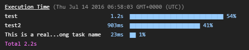

# time-grunt [](http://travis-ci.org/sindresorhus/time-grunt)

> Displays the elapsed execution time of [grunt](http://gruntjs.com) tasks




## Install

Install with [npm](https://npmjs.org/package/time-grunt): `npm install --save time-grunt`


## Example

```js
// Gruntfile.js
module.exports = function (grunt) {
	// require it at the top and pass in the grunt instance
	require('time-grunt')(grunt);

	grunt.initConfig();
	grunt.registerTask('default', []);
}
```

## Clean layout

To reduce visual clutter `time-grunt` automatically hides tasks that take less than 1% of the total time.

It see all tasks, run Grunt in verbose mode: `grunt --verbose`.


## License

MIT License • © [Sindre Sorhus](http://sindresorhus.com)
